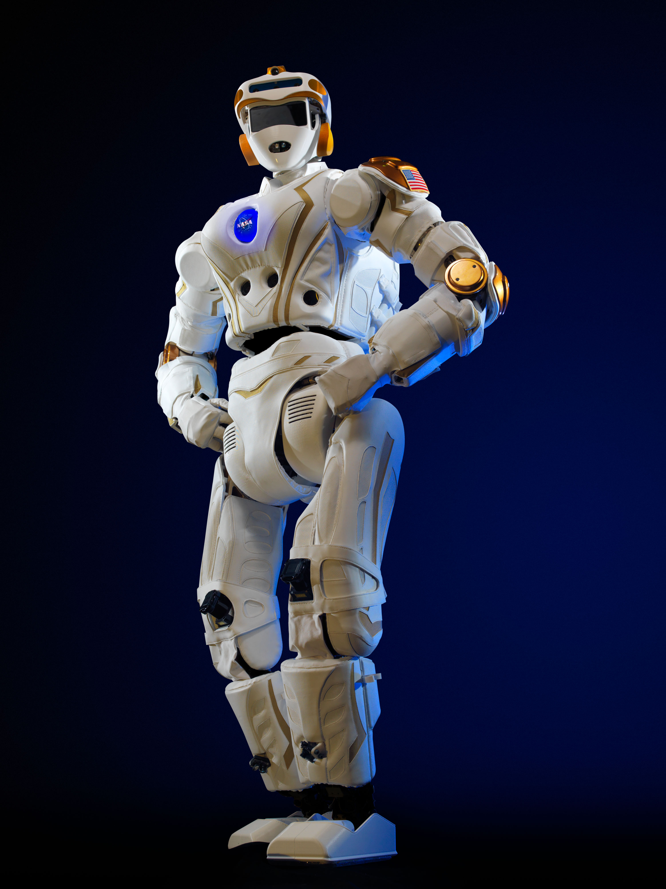

# Valkyrie

- total height: 1.87m
- total weight: 129kg
- type: biped anthropomorphic
- architecture: modular: arm, leg, torso and pelvis can be removed from a single point. Joints architecture is reused whenever possible. The first joint in the arms, legs and waist kinematic chain are all essentially the same actuator. The neck shares the same actuators as the wrist roll but uses traditional rigid actuators form in a pitch-roll-pitch architecture.
- modules:
  - arms:
    - shoulder
      - actuators: 3 series elastic actuators whose joint axes share a common point of intersection
      - sensors:
      - degrees of freedom: 3
    - elbow:
      - actuators: series elastic actuator for roll.
      - sensors:
      - degrees of freedom: 1
    - wrist:
      - actuators: series elastic actuator for roll. Parallel linear actuators with single axis load cells in the two-force member are used for pitch and yaw.
      - sensors:
      - degrees of freedom: 3
    - hand:
      - actuators: tendon-driven assemblies
      - sensors:
      - degrees of freedom: 15 (6 actuated, 9 passive)
      - thumb:
        - actuators: geared actuator directly drives the thumb roll
        - sensors:
        - degrees of freedom: 4
      - other fingers:
        - actuators: primary finger contains passive adduction degree of freedom. Passive elastic elements open the fingers
        - sensors:
        - degrees of freedom: 3
  - legs:
    - hip:
      - actuators: yaw, roll and pitch implemented with rotary Series Elastic Actuators
      - sensors:
      - degrees of freedom: 2
    - knee:
      - actuators: pitch implemented with rotary Series Elastic Actuators
      - sensors:
      - degrees of freedom: 1
    - ankle:
      - actuators: pitch and roll with a pair of parallel linear Series Elastic Actuators, similar to the waist
      - sensors:
      - degrees of freedom: 2
  - head:
    - neck:
      - actuators:
      - sensors:
      - degrees of freedom: 3
    - skull:
      - sensors:
  - torso:
    - waist:
      - actuators: pair of parallel Series Elastic Actuators for pitch and roll. Rotary SEA provides yaw motion;
      - sensors:
      - degrees of freedom: 3
    - motor control with Turbodriver
      - powers 19 Degrees of Freedom in the torso, pelvis, legs and arms;
      - force-air cooled motor bridge;
        - 30A continuously and 60A for short burst high torque;
      - powers and routes signals for multiple sensors;
      - has microcontroller and FPGA;
        - read embedded force and torque sensors;
        - closed loop control based on any sensors combination;
    - power source:
      - type: dual output voltage battery
      - energy: 1.8 kWh
      - weight: 14 kg
      - power density:
      - energy autonomy (whole robot):
        - thethered: infinity
        - thetherless: 1 hour
    - sensors:
- actuators:
  - rotary Series Elastic Actuators
    - frameless brushless DC motor;
      - high speed relative encoder on the motor rotor for communication
      - rotor attached to harmonic drive wave generator
      - stator attached to harmonic drive circular spline;
    - custom torsion spring between harmonic drive flex cup and joint output;
      - sensor mounted measures only spring deflection;
    - absolute joint position measured with coaxial magnetic sensor;
      - measure true output and joint input;
    - belt drive between motor and harmonic;
      - efficiency at high speeds;
      - hip and knee extension and flexion only;
  - linear Series Elastic Actuators
    - prepackaged motor with spur gear;
    - ball screw nut on a linear slider;
    - motor mounted on springs behind the actuator;
    - linear deflection measured by 32-bit sensor;
    - two force member for parallel actuation across two degress of freedom;
    - position sensing with magnetic absolute position encoders;
- Control:

  - computation hardware:
    - three Intel Core i7 COM Express CPU’s, each with8GB of DDR3 memory;
    - CARMA development kit, containing a Tegra3 ARM A9 processor with a NVIDIA Quadro 1000M GPU, for parallel sensor interpretation algorithms;
    - Run the high-level robot controllers and process, compress and deliver sensor data;
    - Data can be shipped via a wired Ethernet or WiFi connection;
  - Control device operated by human:
  - Automatic controlling algorithms:

- Series elastic actuators
- 44 degrees of freedom

## References

[1] Radford, N.A. et. al. - Valkyrie: NASA’s First Bipedal Humanoid Robot
<https://sites.utexas.edu/hcrl/files/2016/01/jfr-nasa-hcrl-final.pdf>

[2] Paine, N et al - Actuator Control for theNASA-JSC Valkyrie Humanoid Robot:A Decoupled Dynamics Approach for Torque Controlof Series Elastic Robots.
<http://sites.utexas.edu/hcrl/files/2016/01/jfr-valkyrie-actuator-control-final.pdf>
